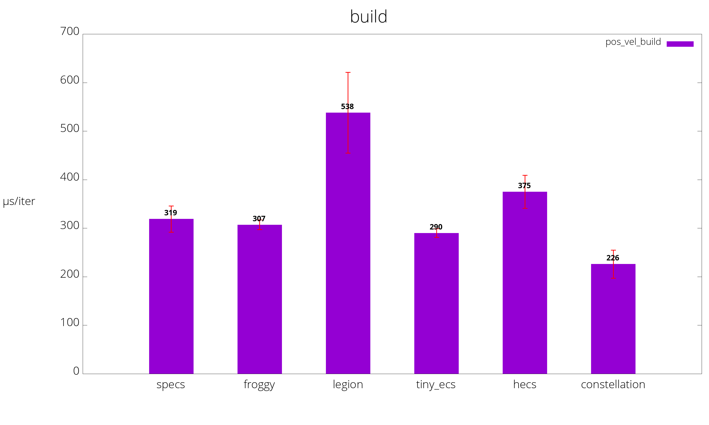

# Benchmarks of various Rust Entity Component Systems

**Notes:**

- if a bench is written in the idiomatic way for an ECS, please let me know
- there will be more benches added soon
- the old parallel benches have been removed for now
- some older ECS that have not seen maintenance in over 3+ years are removed

## Benchmarks
Benchmarks are run on [Travis CI](https://travis-ci.org/lschmierer/ecs_bench/).

Benchmarks are located in `benches/[bench_name]_[ecs_crate_name].rs`.

 Library         | pos_vel build                 | pos_vel update                 |
 --------------- |:-----------------------------:|:------------------------------:|
 [legion]        | 538 µs/iter (+/- 83)        | 1 µs/iter (+/- 0)        |
 [tiny_ecs]      | 290 µs/iter (+/- 9)      | 10 µs/iter (+/- 0)      |
 [hecs]          | 375 µs/iter (+/- 34)          | 4 µs/iter (+/- 0)          |
 [specs]         | 319 µs/iter (+/- 27)         | 3 µs/iter (+/- 0)         |
 [froggy]        | 307 µs/iter (+/- 10)        | 9 µs/iter (+/- 0)        |
 [constellation] | 226 µs/iter (+/- 29) | 6 µs/iter (+/- 0) |

[legion]: https://github.com/jaynus/legion
[constellation]: https://github.com/TomGillen/constellation/
[hecs]: https://github.com/Ralith/hecs/
[froggy]: https://github.com/kvark/froggy
[specs]: https://github.com/slide-rs/specs
[tiny_ecs]: https://gitlab.com/flukejones/tiny_ecs/

Visualization of benchmarks, smaller is better.

### pos_vel
 * 1000 entities with `position` and `velocity` components
 * 9000 entities with `position` components only
 * stub `render` system
 * `physics` system: `position += velocity`

## Notes
 * the benchmarks explore a limited subset of ECS use-cases and do not necessarily reflect the performance of large-scale applications
 * [froggy](https://github.com/kvark/froggy) is technically not an ECS, but a Component Graph System (CGS)
